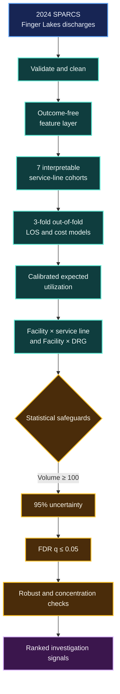

<div align="center">

# Finger Lakes Inpatient Opportunity Analyzer

### Case-mix-adjusted LOS and cost intelligence for hospital operations

[](https://www.python.org/)
[](https://fastapi.tiangolo.com/)
[](https://scikit-learn.org/)
[](#tests)
[](#data-source)
[](#known-limitations)

A full-stack hospital operations analytics prototype built from the **2024 New
York SPARCS de-identified inpatient public-use file**. It compares observed LOS
and total cost with case-mix-adjusted expectations, then ranks statistically
supported facility and service-line areas for human investigation.

[Quick start](#quick-start) · [Method](#analytical-approach) · [Results](#dataset-and-current-results) · [API](#api) · [Limitations](#known-limitations)

</div>

> [!IMPORTANT]
> This is a retrospective analytical and portfolio prototype—not a clinical
> decision system. A positive gap is not proof of waste, poor care, causation,
> or realizable savings. Experimental patient-level estimates must not
> independently drive clinical, discharge, billing, staffing, or resource
> decisions.

## At a glance

<table>
  <tr>
    <td align="center"><strong>139,690</strong><br><sub>clean discharges</sub></td>
    <td align="center"><strong>17</strong><br><sub>facilities</sub></td>
    <td align="center"><strong>7</strong><br><sub>service lines</sub></td>
    <td align="center"><strong>40</strong><br><sub>FDR-supported signals</sub></td>
  </tr>
  <tr>
    <td align="center"><strong>3-fold</strong><br><sub>out-of-fold design</sub></td>
    <td align="center"><strong>95%</strong><br><sub>uncertainty intervals</sub></td>
    <td align="center"><strong>q ≤ 0.05</strong><br><sub>FDR threshold</sub></td>
    <td align="center"><strong>100+</strong><br><sub>minimum group size</sub></td>
  </tr>
</table>

<details>
<summary><strong>What makes the analysis different?</strong></summary>

The project combines service-line-specific out-of-fold case-mix benchmarking,
false-discovery-rate control, trimmed robust gaps, and top-10% residual
concentration. It is designed to reduce attractive but misleading hospital
“savings opportunity” claims.

</details>

## Why this project exists

Raw hospital comparisons are often misleading. A referral hospital treating more
complex patients will naturally have longer stays and higher costs. This project
first estimates the expected utilization for clinically similar cases, then asks:

- Which facilities have observed utilization above their case-mix expectation?
- Which service lines or APR-DRGs contribute most to the difference?
- Does the finding remain after extreme cases are reduced?
- Is the signal broad-based or concentrated in a small number of cases?
- Does it survive correction for testing many groups?

The result is an **investigation priority**, not an automated judgment.

> [!TIP]
> Start with a broad-based, high-volume service-line signal. Then use the DRG
> drill-down and historical examples to form questions for clinical, finance,
> and operations teams.

## Dashboard capabilities

- Executive observed-versus-expected utilization summary
- Case-mix-adjusted comparison across 17 Finger Lakes facilities
- Facility × service-line and facility × APR-DRG opportunity ranking
- Actual/expected LOS and cost comparisons
- 95% uncertainty intervals and minimum-volume suppression
- Benjamini–Hochberg false-discovery-rate correction
- Robust gaps after excluding the extreme 1% of residuals at each end
- Top-10% concentration analysis
- Broad-based, mixed, and outlier-concentrated signal labels
- De-identified historical example drill-down
- Secondary experimental patient-level LOS and cost sandbox
- Health, configuration, metrics, opportunity, and prediction APIs

## Analytical approach



### Service-line cohorts

An unsupervised audit found only a weak two-cluster clinical separation, mostly
emergency medical versus maternity/newborn/elective care. Rather than exposing
opaque cluster IDs, the benchmark uses seven mutually exclusive, interpretable
cohorts:

| Service line | Discharges |
|---|---:|
| Emergency medical | 75,916 |
| Other surgical | 14,961 |
| Maternity | 12,615 |
| Newborn | 12,138 |
| Elective surgical | 10,432 |
| Other medical | 7,678 |
| Pediatric | 5,950 |

Separate out-of-fold models are trained within each cohort. This improves
comparability, although it does not improve individual prediction accuracy.

### Feature policy

The neutral benchmark uses clinical case-mix fields and derived interactions. It
excludes facility so that historical facility differences are not learned away.
It also excludes county, ZIP, race, ethnicity, and payer to avoid treating
socioeconomic disparities as the expected standard.

The shared feature layer derives:

- DRG × severity
- Diagnosis × severity
- Age × severity
- Admission pathway
- Clinical service group
- Population group
- Complexity score
- Secondary-payer availability
- Service line

Procedure codes, patient disposition, total charges, and other post-admission or
outcome fields are intentionally excluded from the benchmark. They can increase
apparent accuracy while leaking the care pathway being evaluated.

### Statistical safeguards

A ranked result must:

1. Contain at least 100 discharges.
2. Have a positive 95% uncertainty signal.
3. Pass Benjamini–Hochberg FDR correction at `q ≤ 0.05`.
4. Retain a positive gap after 1%–99% residual trimming.

Ranking uses the smaller of the confidence-bound and robust estimates. The
top-10% concentration measure then classifies the result as:

- **Broad-based:** distributed across many cases
- **Mixed:** both general variation and extreme cases contribute
- **Outlier-concentrated:** a relatively small number of cases dominate

| Dashboard label | Visual meaning | Recommended first action |
|---|---|---|
| 🟢 **Broad-based** | Difference is distributed across many cases | Review the common workflow |
| 🟡 **Mixed** | General variation and extreme cases both matter | Split routine and complex cases |
| 🔴 **Outlier-concentrated** | A small case group dominates | Begin with complex-case review |

## Dataset and current results

| Item | Value |
|---|---:|
| Raw Finger Lakes records | 140,528 |
| Records retained after cleaning | 139,690 (99.4%) |
| Facilities | 17 |
| Actual bed-days | 835,259 |
| Total analyzed cost | $2.379B |
| Ranked FDR-supported opportunities | 40 |

### Experimental individual prediction performance

These metrics apply to the secondary prediction sandbox, not the primary
aggregate opportunity analysis.

| Metric | Result |
|---|---:|
| LOS MAE | 3.39 days |
| LOS R² | 0.333 |
| LOS RMSE | 6.81 days |
| Cost MAE | $7,280 |
| Cost R² | 0.495 |
| Cost RMSE | $15,548 |
| High-cost recall | 0.412 |
| High-cost precision | 0.747 |

The model misses approximately 59% of high-cost cases. These results are not
strong enough for individual operational or clinical decisions.

### Opportunity benchmark validation

| Metric | Result |
|---|---:|
| OOF records | 139,690 |
| Folds per service line | 3 |
| LOS MAE | 3.45 days |
| LOS R² | 0.313 |
| Cost MAE | $8,284 |
| Cost R² | 0.478 |

The service-line benchmark intentionally prioritizes comparable, interpretable
group analysis over patient-level prediction performance.

## Project structure

```text
.
├── backend/
│   ├── app.py                 FastAPI application and artifact serving
│   ├── features.py            Shared outcome-free feature engineering
│   ├── train.py               Cleaning, modeling, benchmarking, artifacts
│   ├── requirements.txt       Pinned Python dependencies
│   └── artifacts/
│       ├── config.json        Feature order, categories, UI options
│       ├── metrics.json       Dashboard and opportunity-analysis results
│       ├── encoder.joblib     Fitted categorical encoder
│       ├── los_model.joblib   Experimental LOS model
│       └── cost_model.joblib  Experimental cost model
├── frontend/
│   └── index.html             Dependency-free HTML/CSS/JavaScript dashboard
├── docs/
│   └── CLUSTERING_AND_METHOD.md
├── tests/
│   └── test_app.py            Backend and artifact smoke tests
├── Dockerfile
└── README.md
```

## Quick start

### Requirements

- Python 3.12 or newer
- Approximately 1 GB of free memory for running the included application
- More memory is recommended for retraining

### Install and run

```bash
git clone https://github.com/rajashekarakula19-spec/los-pjt.git
cd los-pjt

python3 -m venv backend/venv
backend/venv/bin/pip install -r backend/requirements.txt

cd backend
venv/bin/uvicorn app:app --reload --port 8000
```

Open:

- Dashboard: <http://127.0.0.1:8000>
- Interactive API documentation: <http://127.0.0.1:8000/docs>
- Health check: <http://127.0.0.1:8000/api/health>

The trained artifacts are included, so downloading the source CSV is not
required to run the dashboard.

## Obtain the public data and retrain

The source file is the official [2024 SPARCS de-identified inpatient
dataset](https://health.data.ny.gov/Health/Hospital-Inpatient-Discharges-SPARCS-De-Identified/sf4k-39ay).

Download the Finger Lakes extract from the project root:

```bash
mkdir -p data

curl -G "https://health.data.ny.gov/resource/sf4k-39ay.csv" \
  --data-urlencode "\$where=health_service_area='Finger Lakes'" \
  --data-urlencode "\$limit=200000" \
  --output data/sparcs.csv
```

Retrain all benchmark and prediction artifacts:

```bash
backend/venv/bin/python backend/train.py data/sparcs.csv
```

Training replaces the contents of `backend/artifacts/`. The CSV is intentionally
excluded by `.gitignore` and should not be committed.

## API

| Method | Route | Purpose |
|---|---|---|
| `GET` | `/api/health` | Model and opportunity-artifact readiness |
| `GET` | `/api/opportunities` | Benchmark method, facilities, findings, examples |
| `GET` | `/api/config` | Dropdown values and prediction defaults |
| `GET` | `/api/metrics` | Complete dashboard artifact |
| `POST` | `/api/predict` | Experimental individual LOS/cost estimate |

### Opportunity filters

```bash
curl "http://127.0.0.1:8000/api/opportunities?facility=STRONG%20MEMORIAL%20HOSPITAL"
curl "http://127.0.0.1:8000/api/opportunities?opportunity_id=0"
```

### Experimental prediction example

```bash
curl -X POST "http://127.0.0.1:8000/api/predict" \
  -H "Content-Type: application/json" \
  -d '{
    "age": "70 or Older",
    "admission": "Emergency",
    "severity": "Major",
    "drg": "SEPTICEMIA AND DISSEMINATED INFECTIONS",
    "payer": "Medicare",
    "threshold": 40000
  }'
```

## Tests

```bash
backend/venv/bin/python -m unittest discover -s tests -v
```

The suite checks artifact loading, opportunity schema, robust/FDR fields,
engineered features, health status, and prediction output.

## Docker

```bash
docker build -t los-opportunity-analyzer .
docker run --rm -p 7860:7860 los-opportunity-analyzer
```

Open <http://127.0.0.1:7860>.

## Interpretation guidance

<details open>
<summary><strong>Example: interpreting a ranked result correctly</strong></summary>

Suppose a facility/DRG group shows:

```text
Raw net cost difference:       $16.7M
Robust net cost difference:    $14.1M
Top-10% concentration:              62%
FDR-adjusted q-value:             <0.05
Signal pattern:                    Mixed
```

Correct interpretation:

> This is a high-volume, statistically supported difference that remains after
> reducing the influence of extreme cases, but a substantial portion is still
> concentrated. Review internal clinical complexity, discharge delays, resource
> use, and cost accounting before proposing an intervention.

Incorrect interpretation:

> The hospital wasted $14.1 million and can automatically save it.

</details>

## Known limitations

- The analysis covers one region and one discharge year.
- SPARCS is administrative discharge data; APR-DRG, severity, and diagnosis may
  not be finalized at admission.
- The public file lacks exact dates, longitudinal patient identifiers, secondary
  diagnoses, present-on-admission flags, laboratory values, and operational-delay
  timestamps.
- Repeated patients cannot be accounted for in the uncertainty calculation.
- Referral-hospital complexity and structural hospital differences may remain
  unmeasured.
- Global calibration makes results relative opportunity signals, not absolute
  causal savings estimates.
- External or temporal validation requires another year of data.
- Production healthcare use would require privacy, security, governance,
  monitoring, clinical review, and regulatory assessment.

## Methodology and related work

See [Clustering audit and benchmark rationale](docs/CLUSTERING_AND_METHOD.md) for
the clustering results, benchmark decision, related research, and detailed
limitations.

## Data source

New York State Department of Health, Statewide Planning and Research Cooperative
System (SPARCS), 2024 Hospital Inpatient Discharges De-Identified Public Use File.

The source dataset is public and de-identified. This repository does not include
the raw CSV or identifiable patient information.

## Author

Rajashekar (Ak) Akula
